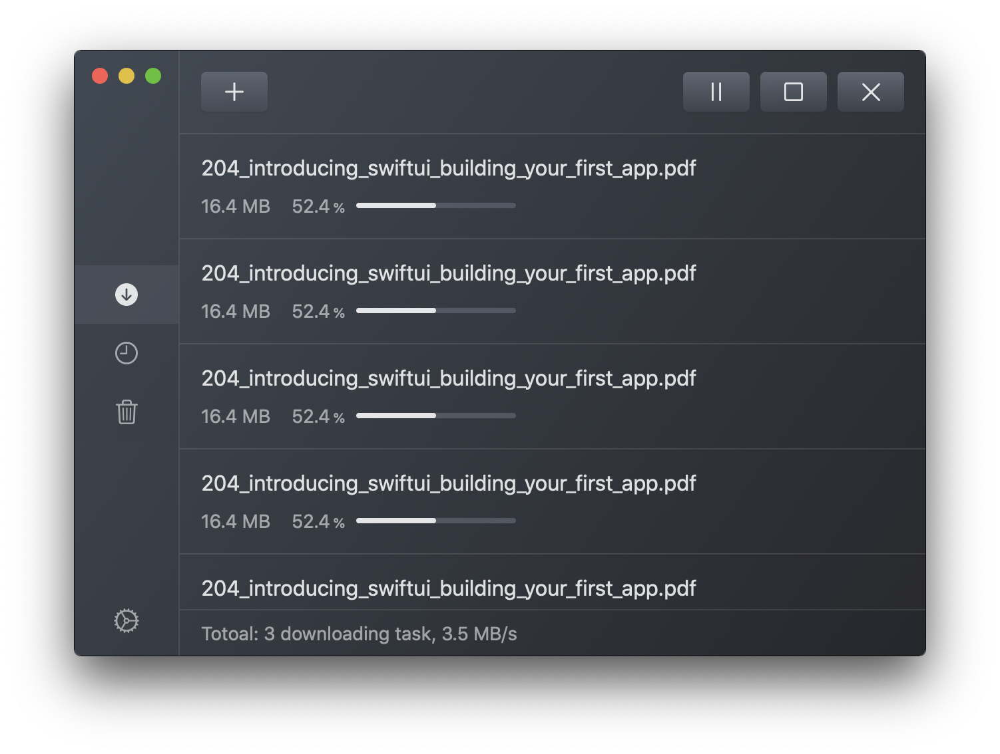

# Aira
Aira is a macOS Aria2 client written in SwiftUI, still in early development.

## Screenshot

## Prerequisites
macOS 10.15+

## Test and Build Environment
- macOS Catalina 10.15.3
- Xcode 11.3.1
- Swift 5.2